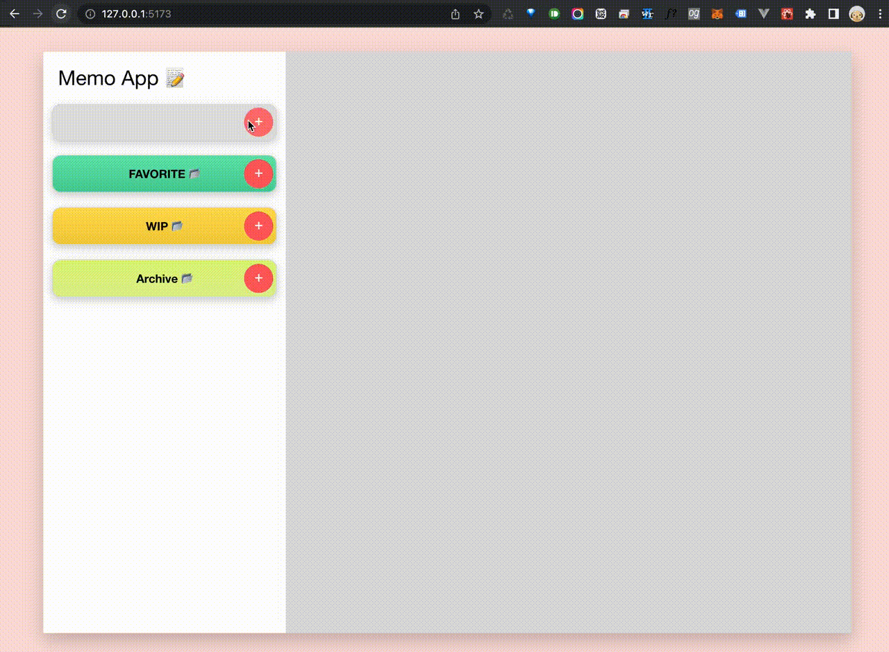

# Memo App




## Libraries used

- Node
  - Node v16.16
  - NPM 8.11.0


- Build Tool
  - Vite


- Framework
  - React.js
  - Redux
  - redux-localstorage-simple
  - redux-logger


- CSS
  - Stylus
  - nib
  - FontAwesome


- Formatter
  - Prettier
  - ESLint


## Setup

```
$ npm i
```

## Run


```
$ npm run dev
```